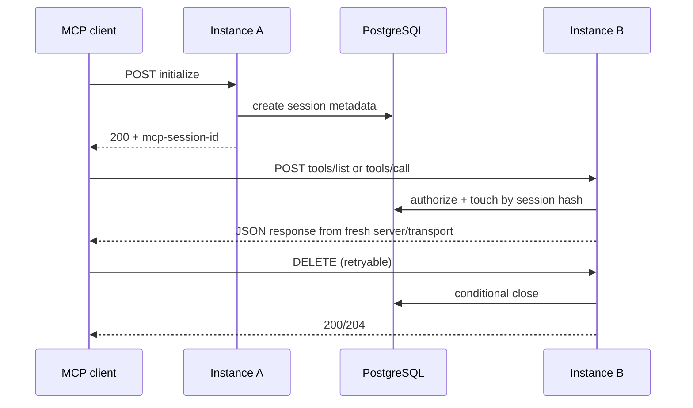

# Remote MCP Session Architecture

更新时间：2026-07-21

## Decision

ContextEngine uses **path A: reconstructable stateless POST handling** for the
current Remote MCP surface. The SDK's `StreamableHTTPServerTransport` keeps
`sessionId`, `_initialized`, request-to-stream mappings, active SSE streams and
the connected `McpServer` in private in-memory fields. There is no supported API
to restore those fields in another process, so a database row alone cannot make
the stateful transport durable.

The application persists the session metadata and performs authorization,
expiry, status and protocol checks before every request. An instance then builds
a fresh `McpServer` and a fresh transport with `sessionIdGenerator: undefined`
for each JSON POST. This is safe for the current read-only retrieval tools:
tool definitions and handlers are deterministic process configuration, and the
engine is resolved from the authorized workspace on demand.

The durable store must contain at least:

- a SHA-256 hash of the opaque `mcp-session-id`;
- workspace and principal binding;
- the negotiated protocol version;
- active/closing/closed status;
- database-clock `last_seen_at`, plus created/updated audit timestamps.

The raw session id and bearer token are never stored or logged.

## Supported request model

`POST` requests include the normal MCP JSON and Accept headers. The application
validates the Bearer principal, workspace ACL, session hash, status, idle TTL
and protocol version before handing the request to the fresh transport. MCP
notifications are accepted as JSON POSTs and return `202` without a response
body.

The current path deliberately does **not** provide a resumable GET/SSE stream.
GET returns `405` with `Allow: POST, DELETE`; this is an explicit capability
boundary, not an accidental loss of a stream. Supporting GET or server-initiated
notifications would require an external event store and routing of live stream
connections, or path B's owner lease plus internal forwarding.

## Failure model

- Unknown, expired and closed sessions return `404` without revealing whether a
  session belonging to another principal exists.
- A workspace, principal or bearer mismatch also returns `404`.
- A protocol-version mismatch returns `400`.
- DELETE is idempotent: a missing or already closed session has the same success
  response as a first close.
- TTL and all status transitions use PostgreSQL `clock_timestamp()`, not the
  Node.js wall clock.
- A retry of a read-only tool call is permitted. Lifecycle operations are
  conditional and idempotent; future mutating tools must add an idempotency key
  before being exposed through this path.

## Rejected alternatives

1. Persisting only the session id and recreating a stateful SDK transport does
   not work because the SDK validates private in-memory state and has no restore
   hook.
2. Storing an owner instance id without forwarding or verifiable routing does
   not provide failover and is therefore not a durable-session implementation.
3. Keeping the existing process `Map` is retained only as an explicit memory
   compatibility mode; it is not the default PostgreSQL deployment behavior.

## Reproducible spike

`test/mcp-session-reconstruction.test.ts` starts two independent HTTP servers
over a shared durable metadata map. It proves initialize on A followed by
notification, `tools/list`, retrieval, GET rejection and idempotent DELETE on B.
The test uses the installed SDK transport and is the protocol gate for the
implementation below; it does not rely on manual curl output.

